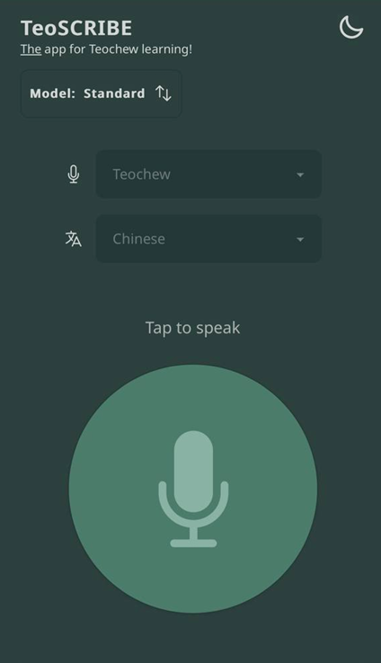
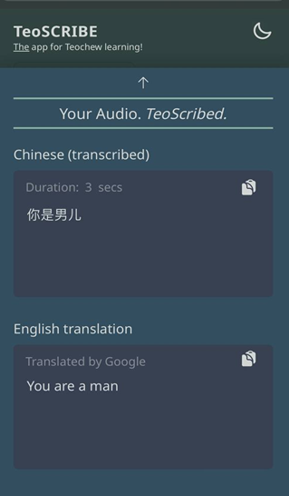

## TeoSCRIBE
*Preserving Teochew Through Technology*

**TeoSCRIBE** is a mobile-friendly web application that transcribes **Teochew speech** into **Chinese** or **English text**.  
It is designed to preserve the Teochew dialect, a largely oral language without a standardized writing system by making it easier for younger generations to learn and practice.

- Teochew is an endangered dialect with no formal writing system, spoken mainly by the elderly.
- Younger generations struggle to learn it, putting its cultural survival at risk.
- TeoSCRIBE helps bridge the oral–written gap with speech-to-text transcription and translation.
<br/>

<p align="left">
  
  &nbsp;&nbsp;&nbsp;
  
</p>

## Features

- **Speech-to-Text (ASR)**: Transcribe Teochew audio into Chinese or English text.  
- **Bilingual Support**: Chinese and English outputs using Google Cloud Translate.  
- **Mobile Web App**: Simple, accessible UI for older and younger generations alike.  
- **User-Friendly Design**: Large buttons, clean layout, and minimal steps for recording.  

## Technical Overview

### 1. Data Preparation
- **Sources**: Subtitled Teochew videos.  
- **Pipeline**:  
  - Voice Activity Detection (VAD) → Segmented audio clips  
  - OCR (Optical Character Recognition) → Extract subtitles  
  - Noise reduction + image enhancement for better alignment:contentReference

### 2. Model Training
- **Teacher Model**  
  - Fine-tuned Whisper-Small with **LoRA (Low-Rank Adaptation)**  
  - Augmented with semantic-aware loss (Sentence-BERT cosine distance)  
  - Achieved significant improvement in contextual transcription

- **Student Model**  
  - **Self-training** with unlabelled data + confidence filtering  
  - Improved stability and captured underrepresented words (e.g., “大城市”, “定居”)

### 3. Web Application
- **Frontend**: React + Vite, styled with TailwindCSS + DaisyUI  
- **Audio Recording**: RecordRTC, ffmpeg  
- **Backend**: FastAPI + Uvicorn, hosting fine-tuned models  
- **Translation**: Google Cloud Translate  

## 📦 Installation & Usage

### Prerequisites
- Node.js (v18+ recommended)  
- Python 3.10+  
- Google Cloud API key (for translation service)  

### Frontend Setup
```bash
cd frontend
npm install
npm run dev
```
- Strictly adhere to the required Python version (3.9.13) to avoid compatibility issues.
- Make sure to install all dependencies for both the backend and frontend before running the application.

### Contributors

| Name                     | GitHub                                       | Contributions                                                    |
| ------------------------ | -------------------------------------------- | ---------------------------------------------------------------- |
| **Tan Yee Ying**         | [@tyeeying](https://github.com/tyeeying)     | Model training, ML training pipeline, data annotation            |
| **Chen Ningjia**         | [@caydencnj](https://github.com/caydencnj)   | Model training, teacher–student model development, model tuning  |
| **Lee XinYee**           | [@xinyee2801](https://github.com/xinyee2801) | Data crawling, cleaning, annotation, labelling                   |
| **Lim Zhen Lun Bryan**   | [@bryanlzl](https://github.com/bryanlzl)     | End-to-end implementation of the application                     |

---

